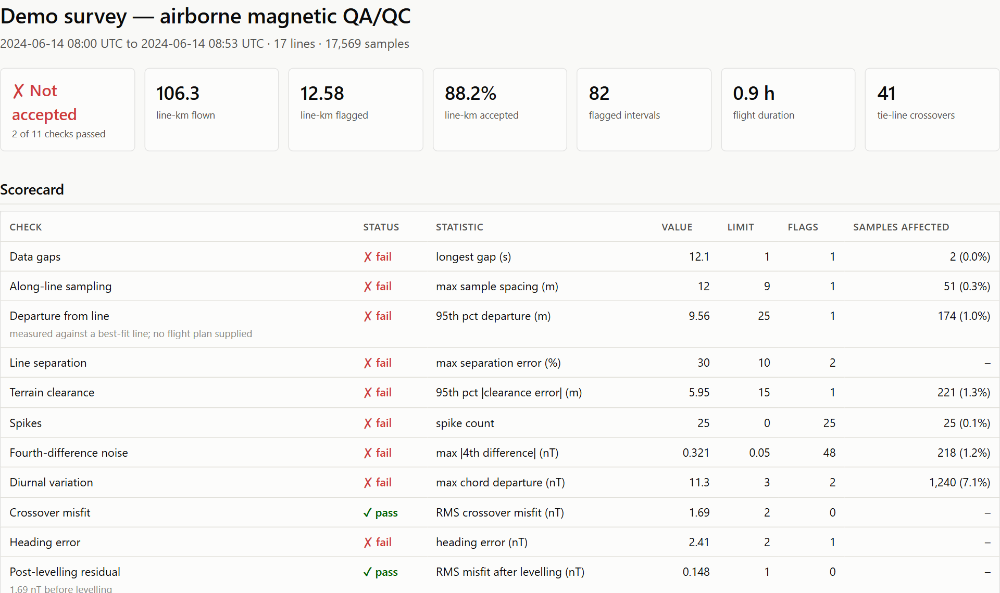
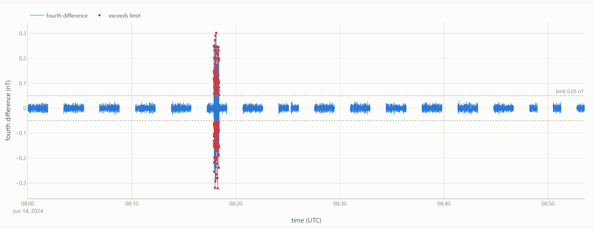
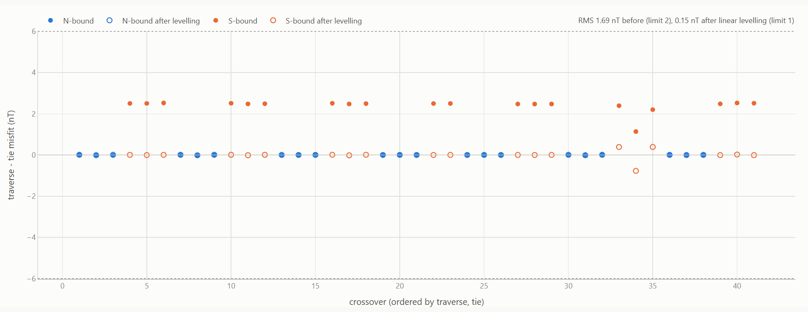
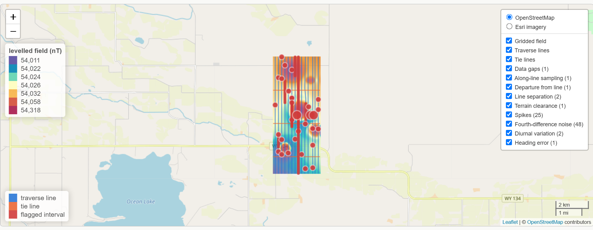
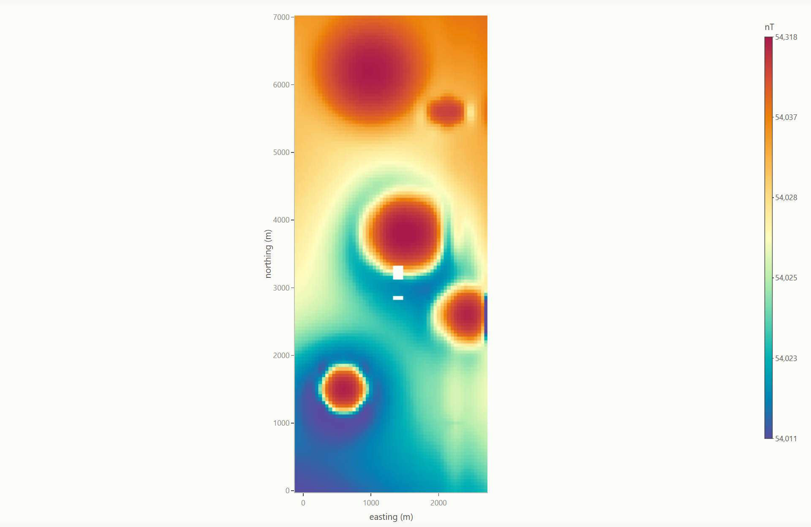
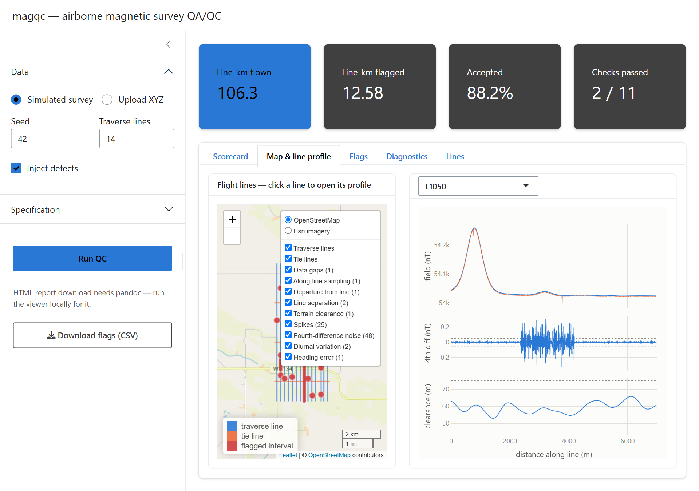

# magqc

[](https://github.com/mjorden/magqc/actions/workflows/R-CMD-check.yaml)
[](LICENSE.md)

QA/QC for airborne magnetic survey data, in R.

`magqc` takes fiducial-level XYZ flight data from an aeromagnetic survey,
tests it against a configurable acceptance specification, and renders a
self-contained HTML report with summary statistics, a pass/fail scorecard,
and a map of the flight lines with every flagged interval drawn on it. It
ships a synthetic survey generator with a catalogue of injected defects, so
the whole workflow runs and is tested end-to-end without any proprietary
data.

```r
# install.packages("remotes")
remotes::install_github("mjorden/magqc")

library(magqc)

sim <- sim_survey()                 # 17 lines, 106 line-km, nine kinds of defect
res <- run_qc(sim)                  # diurnal correction, crossovers, ten checks
res
#> <magqc result>
#>   17,568 samples, 17 lines, 106.3 line-km, 0.9 h of flying
#>   1 of 10 checks passed; 12.6 line-km flagged (88.2% accepted)
#>
#>   FAIL  Data gaps                longest gap (s) = 12.2           1 flag(s)
#>   FAIL  Along-line sampling      max sample spacing (m) = 12      1 flag(s)
#>   FAIL  Departure from line      95th pct departure (m) = 9.53    1 flag(s)
#>   FAIL  Line separation          max separation error (%) = 30    2 flag(s)
#>   FAIL  Terrain clearance        95th pct |clearance error| (m) = 5.95 1 flag(s)
#>   FAIL  Spikes                   spike count = 25                 25 flag(s)
#>   FAIL  Fourth-difference noise  max |4th difference| (nT) = 0.321 47 flag(s)
#>   FAIL  Diurnal variation        max chord departure (nT) = 11.3  2 flag(s)
#>   PASS  Crossover misfit         RMS crossover misfit (nT) = 1.69
#>   FAIL  Heading error            heading error (nT) = 2.41        1 flag(s)

qc_report(res, "magqc-report.html", title = "Block A acceptance QA/QC")
```

Every defect the simulator injects is caught by the check designed for it,
on the line it was injected on, and a defect-free survey produces zero
flags - that is the test suite (`tests/testthat/test-checks.R`).



## What it checks

The specification is a plain list of thresholds from `survey_spec()`. The
defaults describe a typical fixed-wing high-resolution survey and are a
starting point, not a standard; real acceptance criteria come from the
contract.

| Check | Statistic | Default limit |
|---|---|---|
| Data gaps | longest break in the record | 1 s |
| Along-line sampling | ground distance between consecutive samples | 1.5 x nominal (9 m at 60 m/s, 10 Hz) |
| Departure from line | perpendicular distance from the planned line, or from a best-fit axis when no plan is supplied | 25 m |
| Line separation | centroid-to-centroid spacing of adjacent traverses, perpendicular to the planned azimuth | 200 m +/- 10 % |
| Terrain clearance | radar altimeter against the nominal drape | 60 +/- 15 m |
| Spikes | robust z-score of the fourth difference | 6 sigma |
| Fourth-difference noise | `(x[i-2] - 4x[i-1] + 6x[i] - 4x[i+1] + x[i+2]) / 16` on the despiked field | 0.05 nT |
| Diurnal variation | base-station departure from a 60 s linear chord; samples flown inside an exceedance window are flagged | 3 nT |
| Crossover misfit | traverse minus tie at every intersection, before levelling | RMS 2 nT; any single crossover 6 nT |
| Heading error | difference in mean crossover misfit between opposing flight directions (pre-levelling) | 2 nT |
| Post-levelling residual | RMS crossover misfit after tie-line levelling; crossings a per-line correction cannot reconcile are flagged | RMS 1 nT; any single crossover 3 nT |

Every check returns the same flag table - one row per flagged interval with
the row indices, fiducials, times, position, the value that tripped it and
the limit - so the scorecard, the map and the flag table are all the same
object viewed three ways. Checks can be run individually
(`check_fourth_difference(survey, spec)`) to re-test one criterion with a
different threshold.

## The report

`qc_report()` renders a single HTML file (no sidecar directory) containing:

- headline tiles - line-km flown, flagged and accepted; checks passed; flight duration; crossover count
- the scorecard, with the statistic, its limit and the number of samples affected per check
- a leaflet map of every line, with a toggleable layer per check drawing its flagged intervals (or markers, for single-sample and survey-wide findings) and a popup describing each one
- a filterable table of every flagged interval
- diagnostics: fourth-difference trace against its limit, terrain clearance against its band, the base-station record with exceedance windows shaded, and crossover misfit by flight direction
- per-line statistics and the specification the survey was tested against

The demo report (17,500 samples) is under 4 MB. Diagnostic traces are one
per line with rounded values and tenth-of-a-second UTC timestamps (kept as
strings: plotly renders numeric dates in the viewer's local zone), and
plotly's ~1 MB "basic" bundle is fetched at render time in place of the
full 3.7 MB library; offline, the full library is embedded and the file is
~6.5 MB. Set `options(magqc.partial_bundle = FALSE)` to skip the fetch.



## Tie-line levelling

```r
res$levelling
#> <magqc tie-line levelling>
#>   linear corrections on 14 traverses (13 linear, 1 constant, 0 without crossovers)
#>   crossover RMS: 1.69 nT before, 0.15 nT after (41 crossovers)
lev <- level_ties(res, order = "constant")   # or run it standalone on a survey
lev$coefficients                              # line, order, n_crossovers, c0 (nT), c1 (nT/m)
```



`run_qc()` levels by default when tie lines exist: each traverse gets a
least-squares offset (plus a drift term in distance along the line when it
has three or more crossings), tie lines are held fixed, and the levelled
field is added as `mag_lev`. The scorecard reports the crossover RMS
*before* levelling (the acceptance statistic) and the residual *after*
it; a crossing that survives the correction is flagged, because heading
error, lag or a bad tie do not level out. The noise checks and the
heading-error check keep operating on the unlevelled field.

## Gridded field

```r
res$grid
#> <magqc grid>
#>   mag_lev: 59 x 143 nodes at 50 m (mincurv), 0 of 8437 blanked
#>   17569 samples; RMS fit 1.19 nT; range 53987.9 to 54318.4 nT
g <- grid_field(res, cell = 25, method = "idw")   # or grid any channel yourself
plot_grid(res)
```

`run_qc()` grids the levelled field by **minimum curvature** (Briggs 1974)
at a quarter of the traverse spacing: samples are binned to the nearest
node as a local plane evaluated at the node (a plain mean sits at the
sample centroid, half a cell off at line ends), free nodes satisfy the
13-point discrete biharmonic equation with free edges, and up to 40,000
nodes the constrained system is solved exactly as a sparse linear system;
larger grids relax from a coarse-to-fine start. Samples flagged as spikes
are left out (a known point defect is not field), and nodes farther than
half a line spacing from any sample are blanked. The grid is the "Gridded field" layer
on the map (an image overlay in its own pane under the flight lines, with a
histogram-equalised Spectral scale and legend), a heatmap in the projected
fallback, and its own panel in the report and viewer. It is also the
surface that reduction to the pole will operate on.





## Interactive viewer

```r
run_viewer()                       # simulated survey, editable spec
run_viewer(res)                    # open an existing result
```



A Shiny app (bslib) with the same engine behind it: load the simulated
survey or upload an XYZ file plus base-station CSV, edit every threshold in
the sidebar, re-run, click a flight line on the map to open its profile
(field, fourth difference and clearance against distance along the line,
with every flagged interval shaded and labelled), browse the flag table,
and download the report or the flags as CSV.

The same app runs entirely in the browser via [shinylive](https://posit-dev.github.io/r-shinylive/)
(webR) — no server. `tools/build-shinylive.R` vendors the package sources
beside the app and exports a static site; the `viewer-pages` workflow
publishes it to GitHub Pages on every push to `main`. The in-browser build
cannot render the HTML report (no pandoc), so that button is replaced by a
note; everything else works, including uploads.

## Input data

`read_xyz()` parses the Geosoft-style ASCII interchange format most
contractors deliver (`/` comment header, `Line 1000` / `Tie 9000` blocks,
whitespace-delimited samples), with a column map for whatever the file
calls its fields:

```r
survey <- read_xyz("block_a.xyz",
                   col_map = c(x = "X", y = "Y", time = "TIME",
                               mag_raw = "MAGRAW", radar_alt = "RALT"),
                   time_origin = as.POSIXct("2024-06-14", tz = "UTC"),
                   origin = c(lon = -108.5, lat = 43.2))   # for the map
base <- read.csv("base_station.csv")   # columns: time (POSIXct), mag_base (nT)
res  <- run_qc(survey, survey_spec(line_spacing = 100, nominal_clearance = 80),
               base = base)
```

Any data frame with `line`, `time`, `x`, `y` and `mag_raw` (or `mag`) goes
through `as_survey()`. Coordinates are metres in whatever local or projected
system the survey uses; `lon`/`lat` are optional and only drive the basemap
(without them the map is drawn in local metres). A flight plan
(`line, x0, y0, x1, y1`) makes the departure-from-line check measure
against the plan instead of a best-fit axis.

## The simulated survey

`sim_survey()` flies a block of traverse and tie lines over a synthetic
terrain and magnetic field (five buried sources, a regional gradient, a
diurnal curve with a 1 Hz base-station record) and injects:

| Defect | Where | Caught by |
|---|---|---|
| 25 spikes of 5-40 nT | random traverse samples | Spikes |
| sensor noise raised to 0.25 nT | L1050, 300 samples | Fourth-difference noise |
| 45 m excursion off the planned line | L1090 | Departure from line |
| whole line flown 60 m off position | L1110 | Line separation (both neighbours) |
| flown up to 35 m too high | L1030 | Terrain clearance |
| 12 s dropout | L1070 | Data gaps |
| every second sample missing | L1010 | Along-line sampling |
| +/-12 nT magnetic-storm excursion | base station, 6 min | Diurnal variation |
| +2.5 nT bias on southbound lines | all southbound traverses | Heading error |

`sim$truth` lists each defect with the time window it occupies.

## Design notes

A few things that were not obvious going in:

- **Spikes are detected on the fourth difference, not the field.** A
  running-median (Hampel) filter on the raw field fails on airborne data:
  on a monotone stretch of a smooth anomaly the running median *is* the
  centre sample, the residual collapses to zero and ordinary noise reads as
  many sigma. The fourth-difference operator annihilates anything up to a
  cubic, so the same robust test applied to it sees only the sensor noise.
  Spike amplitude is one sixth of the fourth difference. The series is
  extended by linear extrapolation so the last two samples of a line - where
  the centred operator is undefined - still get a (lower-order) test.
- **Noise tests run per continuous segment.** A data gap is a jump of
  hundreds of metres of field gradient; differenced, it looks like a huge
  spike. Gaps are the gap check's business, so the spike and
  fourth-difference tests break the series wherever the record gaps.
- **Crossovers are found with a local fit.** Intersecting the two lines'
  whole-line axes misses a crossing when a line wanders; the candidate is
  refined by re-fitting each line over ~20 samples around the nearest
  sample and intersecting those axes.
- **Simulated motion has to be smooth in every derivative.** The first
  version of the GPS wander was boxcar-smoothed white noise; it looked
  smooth, but its increments were white, and 0.4 m/sample of jitter across
  a 1 nT/m anomaly flank produced 0.3 nT of sample-to-sample noise that
  tripped the fourth-difference test on a supposedly clean survey. Real
  aircraft do not do that; the wander is now Gaussian-kernel smoothed.

## Tests

```r
devtools::test()
```

Ninety-odd expectations across the geometry helpers, the specification, the
XYZ reader, every check against the simulator's truth table (including
no-false-positive assertions on the lines that have no defect), and a full
report render.

## Not yet

- statistical levelling and micro-levelling (tie-line levelling is in)
- IGRF removal and lag correction (the field is handled as total field; no
  residual/anomaly channel yet)
- reduction to the pole (the grid is in; needs IGRF inclination and
  declination) and other grid filters (upward continuation, derivatives)
- reading a flight plan from KML / Geosoft PLT
- gradiometer and multi-sensor configurations

## License

MIT. See [LICENSE.md](LICENSE.md).
